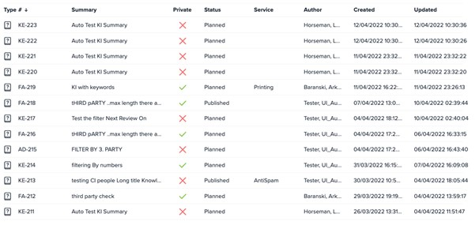
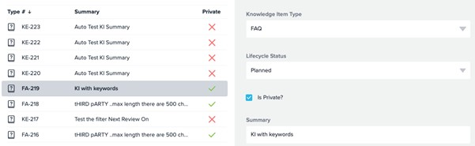

# responsive-table

## The Task

1. On initial page load, load data in items.json (given in the zip) and create a view similar to the below. NB: The most important thing is to make the grid responsive - some columns may be hidden on smaller screens.

   

2. When you click one of the grid rows, create split view, with a form on the right, similar to the below by loading the form structure from form.json (given in the zip) and dynamically creating the corresponding form/view based on the structure in form.json, and filled with the matching data of that row:

   

3. Write a unit test for the right panel form component to verify that it renders correctly

## How to run the app

Download the zip file using the green button,
or clone the repository by running the command
`git clone https://github.com/Nierowheezy/responsive-table.git` or
`git clone git@github.com:Nierowheezy/responsive-table.git` if you are using.

Run the command above in your terminal.

once the command is complete,
run `npm install` which will install all the dependencies in the `package.json` file and then run `npm start` which will start your development server on `localhost:3000`.
